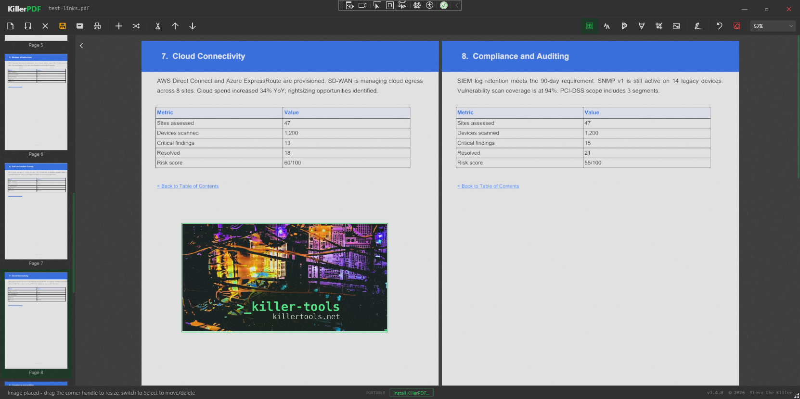
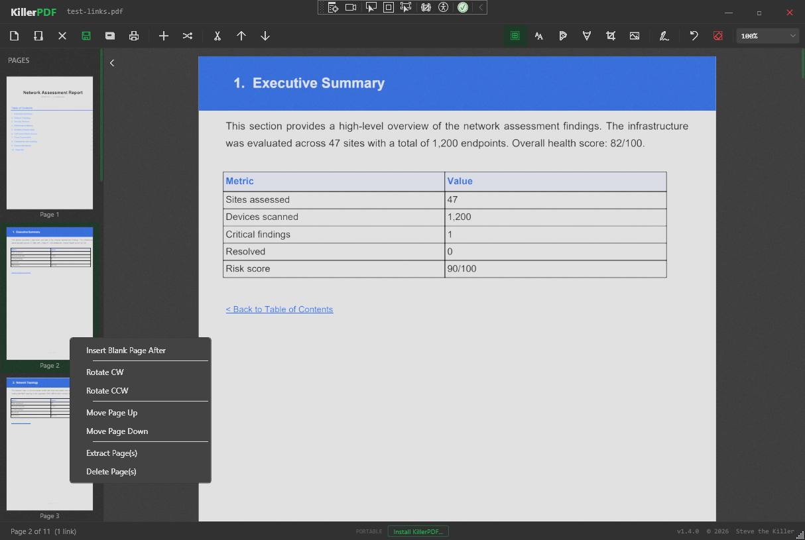

# TDPdf

> **Fork notice.** TDPdf is a fork of [**SteveTheKiller/KillerPDF**](https://github.com/SteveTheKiller/KillerPDF) (GPLv3). All credit for the original design, codebase, and engineering belongs to Steve. TDPdf is maintained by **The Doodle Project, LLC** (Frisco, TX). See [NOTICE](NOTICE) for the full attribution and the list of modifications relative to upstream.

PDF editor for Windows. View, annotate, merge, split, edit text, draw, sign, print, flatten, and open password-protected PDFs without an Adobe subscription or a phone-home. Install or run portable. Single Windows EXE, self-contained — no runtime install required.

## Features

- High-quality rendering via PDFium (Docnet.Core)
- Merge multiple PDFs and split out selected pages, drag-and-drop page reordering
- Inline text editing with font matching against the original document
- Text boxes, freehand drawing, and highlight overlays with adjustable color, size, and opacity
- Draw and save reusable signatures or import a PNG/JPG/BMP image as a signature, click to place anywhere on a page
- Insert images onto any page as resizable annotations — drag the corner handle to scale, burned into the PDF on save
- Right-click sidebar: insert blank page, rotate CW/CCW, move up/down, extract, or delete — works on multi-page selections
- Clickable PDF links and internal cross-references, including TOC back-links
- Multi-page grid view at low zoom levels for context across the whole document
- Zoom preset dropdown with scroll-wheel sync
- Full-text search across the entire document with result highlighting, drag-select to copy text
- Unsaved-changes protection with dirty tracking and title bar indicator
- Close file without quitting (Ctrl+W)
- Print with annotations flattened into the output
- Save Flattened PDF: rasterizes every page at 150 DPI via PDFium into a fully uneditable document
- Password-protected PDF support: prompts for password instead of erroring, decrypted copy held in temp for the session
- Self-installing EXE: running from outside the install path shows an Install / Run Portable dialog; running a newer version shows an Update prompt instead. Installs per-user to %LOCALAPPDATA% (no UAC), registers as PDF file handler, adds Start Menu and optional Desktop shortcuts, uninstalls cleanly via Add/Remove Programs

## Screenshots





## Requirements

- Windows 10 or 11 (x64)
- No runtime install. Everything needed is inside the self-contained single-file EXE.

## Download

Grab the latest signed `TDPdf.exe` from the [Releases page](https://github.com/doodlemania2/TDPdf/releases/latest).

## Build from source

```powershell
git clone https://github.com/doodlemania2/TDPdf.git
cd TDPdf
dotnet publish -c Release -r win-x64 -p:PublishSingleFile=true -p:SelfContained=true
```

Output lands in `bin/Release/net9.0-windows/win-x64/publish/`. The publish step produces a self-contained single-file `TDPdf.exe` plus a versioned `TDPdf-<version>-src.zip` for GPL3 corresponding-source distribution.

Requires Windows and the .NET 9 SDK to build.

## Changelog

See [CHANGELOG.md](CHANGELOG.md).

## License

GPLv3. See [LICENSE](LICENSE). TDPdf is a modified version of KillerPDF; the corresponding source for every released binary is published alongside the EXE as `TDPdf-<version>-src.zip` (GPLv3 §6). If you fork, modify, or redistribute TDPdf, your version must also be released under GPLv3 with source available.
